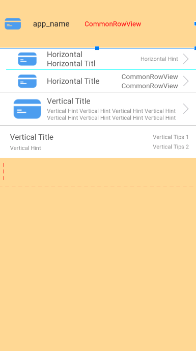

### Integration
``` xml

dependencies {
    compile 'com.cabe.lib.ui:RowView:1.2.1'
}

``` 

### Usage



#### HorizontalRowView


``` xml

    <com.cabe.lib.ui.rowview.HorizontalRowView
        android:id="@+id/frag_me_row_bank_h"
        style="@style/RowViewStyle"
        xmlns:app="http://schemas.android.com/apk/res-auto"
        app:rv_title="title"
        app:rv_titleDrawablePadding="5dp"
        app:rv_titleDrawable="@drawable/icon_row"
        app:rv_showHint="true"
        app:rv_hintTips="hint"
        android:tag="tag"
        android:onClick="onClick" />
         
```

#### VerticalRowView

``` xml

    <com.cabe.lib.ui.rowview.VerticalRowView
        android:id="@+id/frag_me_row_bank_v"
        style="@style/RowViewStyleV"
        xmlns:app="http://schemas.android.com/apk/res-auto"
        app:rv_title="title"
        app:rv_titleDrawablePadding="5dp"
        app:rv_titleDrawable="@drawable/icon_row"
        app:rv_showHint="true"
        app:rv_hintTips="hint"
        app:rv_innerMargin="2dp"
        android:tag="tag"
        android:onClick="onClick" />
         
```

#### TipsRowView

``` xml

    <com.cabe.lib.ui.rowview.TipsRowView
        android:id="@+id/frag_me_row_bank_v"
        style="@style/RowViewStyleV"
        xmlns:app="http://schemas.android.com/apk/res-auto"
        app:rv_title="title"
        app:rv_titleDrawablePadding="5dp"
        app:rv_titleDrawable="@drawable/icon_row"
        app:rv_showHint="true"
        app:rv_hintTips="hint"
        app:rv_innerMargin="2dp"
        app:rv_tips_1="tips1"
        app:rv_tips_2="tips2"
        android:tag="tag"
        android:onClick="onClick" />
         
```

#### GapLineView

``` xml

    <com.cabe.lib.ui.line.GapLineView
        android:id="@+id/frag_me_line_gap_h"
        android:layout_width="match_parent"
        android:layout_height="1dp"
        android:layout_marginTop="10dp"
        app:gl_dashWidth="8dp"
        app:gl_dashColor="#FF0000"
        app:gl_gapWidth="6dp"
        app:gl_gapColor="#0000FF00" />
         
```
